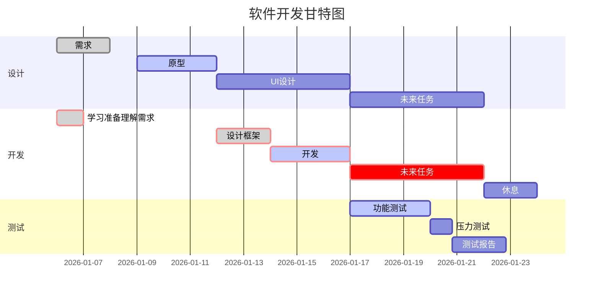
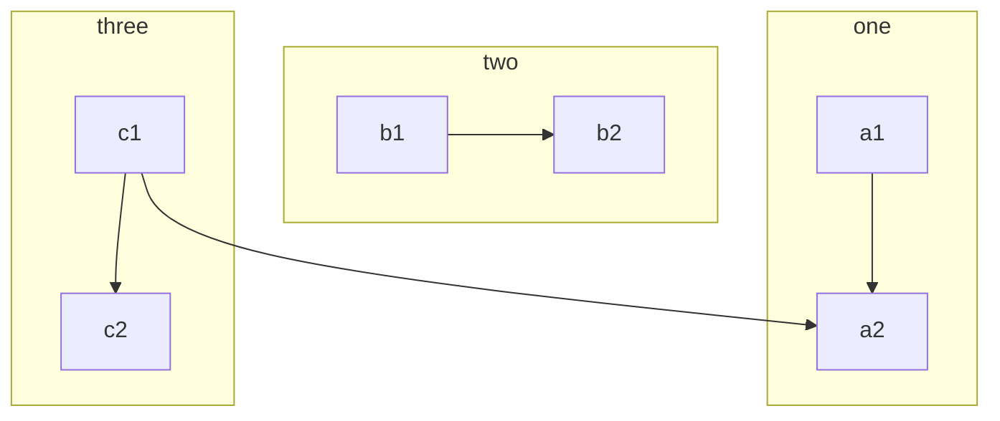

在绘制流程图等简单图形上面，打开图形绘制工具，画完保存，上传图床，复制链接（虽然typora简化了这些），但在看到某博客上面的一些使用asc，unicode字符做的图后，觉得很~~牛逼~~方便，于是便开始找工具制作。

<!-- more -->

先放几个例子

```
+---+     +---+     +---+
| A | --> | C | --> | D |
+---+     +---+     +---+
            |
            |
            v
          +---+
          | E |
          +---+
```

```
               .................
               v               :
+------+     +---------+     +---------+     +---------+     +--------------+
| Task | --> | Created | --> | Audit 1 | --> | Audit 2 | --> | Execute Task |
+------+     +---------+     +---------+     +---------+     +--------------+
               ^                               :
               .................................
```

优先显而易见，兼容性强，体积小。实现这些图的方式有两种

1. 手动绘制，怎么想就怎么画，不受限制。
2. 写代码，使用工具渲染成其他格式（asc，html，avg）。代码复用性强

## Graph easy

这是一个工具，需要掌握一些语法进行渲染

### 安装

在我的manjaro上，配置AUR源后，安装指令如下

```bash
yaourt -S perl-graph-easy
```

### 使用

`graph-easy 文本`即可，更多指令参见`graph-easy --help`

### 语法

- 简单语法

```bash
# 文本内容
[hello]->[world]
# 渲染图
+-------+     +-------+
| hello | --> | world |
+-------+     +-------+
```

- 复杂语法mer

```
[ Client ]{rows:8;} -- (A) Authorizatoin Request --> [ 1.Resource Owner ]{rows:2;}
[ 1.Resource Owner ] -- (B) Authorizatoin Grant --> [ Client ]
[ Client ] -- (C) Authorizatoin Request --> [ 2.Authorizatoin Server ]{rows:2;}
[ 2.Authorizatoin Server ] -- (D) Access Token --> [ Client ]
[ Client ] -- (E) Access Token --> [ 3.Resource Server ]{rows:2;}
[ 3.Resource Server ] -- (F) Protected Resource --> [ Client ]
```

渲染后

```
+--------+  (A) Authorizatoin Request   +------------------------+
|        | ---------------------------> |                        |
|        |                              |    1.Resource Owner    |
|        |  (B) Authorizatoin Grant     |                        |
|        | <--------------------------- |                        |
|        |                              +------------------------+
|        |  (C) Authorizatoin Request   +------------------------+
|        | ---------------------------> |                        |
| Client |                              | 2.Authorizatoin Server |
|        |  (D) Access Token            |                        |
|        | <--------------------------- |                        |
|        |                              +------------------------+
|        |  (E) Access Token            +------------------------+
|        | ---------------------------> |                        |
|        |                              |   3.Resource Server    |
|        |  (F) Protected Resource      |                        |
|        | <--------------------------- |                        |
+--------+                              +------------------------+
```

> 更多的语法参见
>
> [官网](https://metacpan.org/pod/Graph::Easy#One-node)
>
> [部分翻译](https://github.com/tiann/graph-easy-cn/blob/master/SUMMARY.md)

## mermaidmer

mermaid把一些流程图片等简单图片简化成代码，我以前都是用工具制作成图片在上传图床使用，使用mermaid很明显是一个高效率的方法，但需要学习一点它的语法，typorta支持渲染，如果需要在博客上渲染的化需要安装hexo-filter-mermaid-diagrams插件，我的博客还不能渲染，但typora可以导出html





## Drawit

手绘工具，这是一个vim插件，[下载安装](https://github.com/vim-scripts/DrawIt)

### 使用

\di 进入drawit模式

\ds 退出

### 功能

| 按键和指令      | 作用                          |
| --------------- | ----------------------------- |
| left            | 向左绘制                      |
| right           | 向右绘制                      |
| up              | 向上绘制                      |
| down            | 向下绘制                      |
| h               | 左移动                        |
| j               | 下移动                        |
| k               | 上                            |
| l               | 右                            |
| space           | 橡皮擦模式                    |
| PD              | 右下绘制                      |
| PU              | 左下绘制                      |
| HOME            | 左上绘制                      |
| END             | 右上绘制                      |
| v,<,>,^         | 四个箭头                      |
| \v,\\<,\\>,\^   | 四个粗箭头                    |
| crtl+v/鼠标拖动 | 进入visible模式               |
| \l              | 在visible模式下，对选择块画线 |
| \a              | 呈上，画带箭头的线            |
| \b              | 对选择块画盒子                |
| \e              | 对选择块画椭圆                |
| \f 字符         | 以字符填充**光标**区域        |
| \r 字符         | 以字符填充选择块填充          |

下面是我乱画的，随意参考

```bash
┌─────────┐
└─────────┘   |             ------------_-_
              |                         \ /
     +--------+                       X  | 
     |        |     +------+         / \ |
     |        |-----|      |\       X   \|
     +--------+     |      | \     / \   |
                    +------+  \   /   \ /|
                               \ /     X |
                  \   X   X   / X        |
                   \ / \ / \ / /         |                 -------------------------->
                    X   X   X /          |
                          _ _            |
                          \ /            |
         +---+            _'_            |                          +------------+
         |   |            \ /            |                          |333333333333|
         |   |             '            _|_                         |333333333333|
         |   |                          \ /                         |333333333333|
         |   ^-|----------+------___------                          |33333333333|
         |                          \____                           +------------+
         |                               \___                      
     X   /---|>----                          \____                 
    X \ / /                                       \____            
     \ X /                                             \___        
      \ /                                                  \____   
       X                                                        \__

```

> 参考文章[如何制作纯 ASCII 文本流程图](https://www.digglife.net/articles/ascii-flowchart-how-to.html)                     

## python-tabulate

这是一个python的库，用来制作表格，markdown里估计用不到了，但若想将程序的数组输出表格可以用到它

### 安装

```bash
pip install tabulate
```

### 使用

支持传递的数据类型

1. list of lists or another iterable of iterables
2. list or another iterable of dicts (keys as columns)
3. dict of iterables (keys as columns)
4. two-dimensional NumPy array
5. NumPy record arrays (names as columns)
6. pandas.DataFrame

我使用列表做示例

```python
from tabulate import tabulate

a = [['a1','a2'],['b1','b2'],['c1','c2']]
```

- 普通的打印

```python
>>> print(tabulate(a))
--  --
a1  a2
b1  b2
c1  c2
--  --
```

- 可选参数`headers`，指定表格头部
  - 传递指定表头数据
  - `firstrow`代表第一行为头部
  - `keys`使用索引

```python
>>> print(tabulate(a,headers='firstrow'))
a1    a2
----  ----
b1    b2
c1    c2
```

- 可选参数`showindex`，代表行索引
  - True
  - False

```python
>>> print(tabulate.tabulate(a,showindex=True))
-  --  --
0  a1  a2
1  b1  b2
2  c1  c2
-  --  --
```

### 表格样式

- plain

```python
>>> print(tabulate.tabulate(a,tablefmt='plain'))
a1  a2
b1  b2
c1  c2
```

- simple（默认）

```
--  --
a1  a2
b1  b2
c1  c2
--  --
```

- pretty

```
+----+----+
| a1 | a2 |
| b1 | b2 |
| c1 | c2 |
+----+----+
```

- pipe

```
|:---|:---|
| a1 | a2 |
| b1 | b2 |
| c1 | c2 |
```

- github

```
|----|----|
| a1 | a2 |
| b1 | b2 |
| c1 | c2 |
```

- grid

```
+----+----+
| a1 | a2 |
+----+----+
| b1 | b2 |
+----+----+
| c1 | c2 |
+----+----+
```

- fancy_grid

```
╒════╤════╕
│ a1 │ a2 │
├────┼────┤
│ b1 │ b2 │
├────┼────┤
│ c1 │ c2 │
╘════╧════╛
```

> 更多方法参考官方](https://pypi.org/project/tabulate/)

## 总结

Graph-easy毕竟有点老，好久没更新了，为了画asc图掌握语法实在有点费力，没什么特殊需求不建议使用，绘制普通asc流程图我还是建议使用手绘，asc图表建议使用python库，若想绘制精致一点的流程图，时序图，干特图我选择mermaid。

